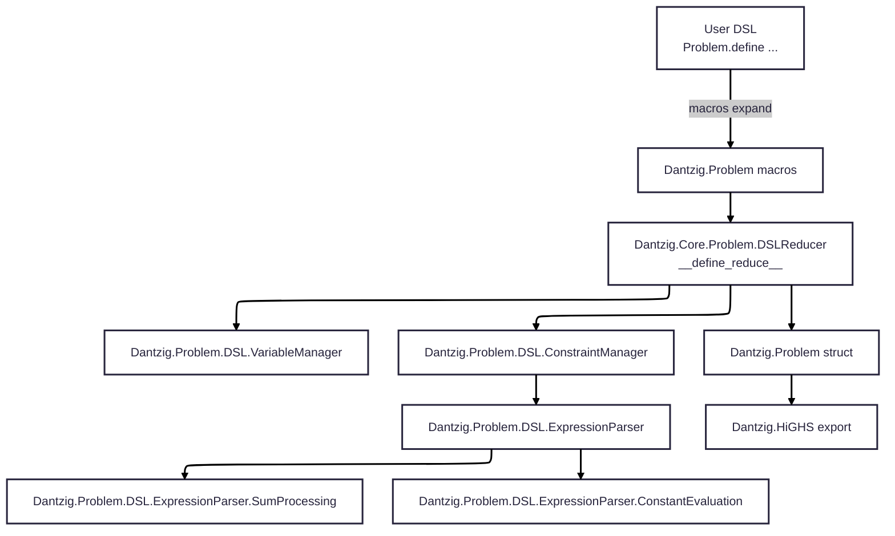
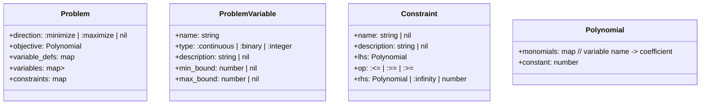
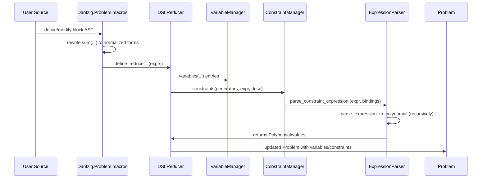
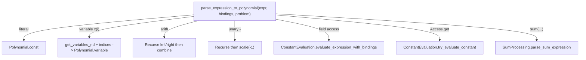
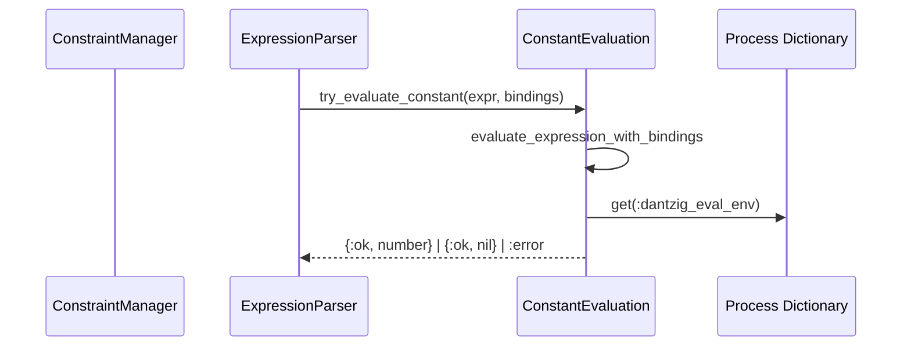
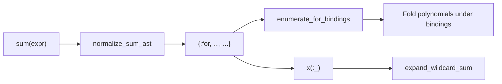
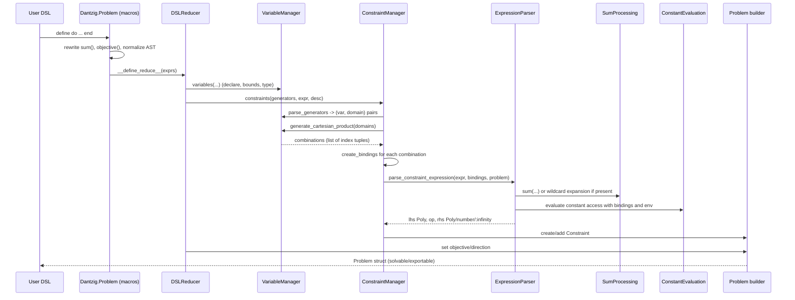

# Dantzig DSL Architecture

This document provides a comprehensive description of the DSL architecture: modules and their responsibilities, data structures, expression parsing and decomposition, recursion strategy, and the end-to-end flow from user code to an internal `Problem` that can be exported to solvers. It also captures a minimal formal grammar for the DSL and highlights inconsistencies/improvement ideas encountered during the review.

---

## High-level Overview

The DSL is macro-based. User code builds a `Dantzig.Problem` through a declarative block:

```elixir
Problem.define model_parameters: %{...} do
  new(name: "...", direction: :minimize | :maximize)
  variables("x", [i <- 0..n], :continuous, "desc" | [bounds...])
  constraints([i <- ...], expr, "optional desc")
  objective(sum(...), direction: :minimize | :maximize)
end
```

Internally, the system:

1) Captures user AST at compile-time via macros defined in `Dantzig.Problem` and `Dantzig.Problem.DSL`.
2) Rewrites selected constructs (notably sum/for) into normalized AST forms.
3) Reduces the AST into an internal `Problem` value through the DSL reducer, delegating to managers:
   - _VariableManager_: declare and index variables
   - _ConstraintManager_: parse generator domains, bind indices, decompose constraint expressions into polynomials and bounds
   - _ExpressionParser_: transform expressions into `Polynomial` values (or special values like `:infinity`)
4) Utilizes an evaluation environment (`:dantzig_eval_env` in the process dictionary) to access `model_parameters` and caller bindings during expression evaluation.
5) Produces a `Problem` structure suitable for export (e.g., to LP format for HiGHS).

### Module Topology



---

## Core Data Structures



Notes:

- Variables are stored in both a 1D map for scalar defs and an N-D map keyed by index tuples, allowing efficient retrieval for `x(i)` and `x(i,j)` patterns.
- `:infinity` is handled specially at the constraint level (never converted into a `Polynomial` constant).

---

## Macro Entry Points and AST Normalization

Key macro entry points:

- `Dantzig.Problem.define/1`
- `Dantzig.Problem.modify/2`
- `Dantzig.Problem.DSL` macros such as `variables/4`, `constraints/2|3`, `objective/1|2`, and helper `sum/1`

Normalization targets:

- `sum(expr)` → normalized into a canonical AST that `SumProcessing` can interpret.
- `sum(for ... <- ..., do: ...)` → normalized to a form that yields `{:for, ..., ...}` internally.
- Optional rewrite of wildcards (e.g., `x(:_)`) via SumProcessing/Wildcard utilities.



---

## Constraint Generation and Binding Propagation

Generators are parsed into `(var_ast, domain)` pairs. The domain can be any enumerable (Range, list, MapSet, etc.). The system builds the Cartesian product of domains and, for each combination, creates a binding map `{i: value_i, j: value_j, ...}`.

```mermaid
flowchart LR
    Gens[Generators: [i <- A, j <- B]] --> Parse(parse_generators)
    Parse --> Values[(A, B)]
    Values --> Product(generate_cartesian_product)
    Product -->|[a1,b1], [a1,b2], ...| Bindings[create_bindings]
    Bindings --> CM[parse_constraint_expression(expr, bindings)]
    CM --> Add[Constraint.new_linear(...)]
```

Key points:

- Bindings are passed down into the expression parser so that `i, j, ...` can be resolved in constant access (e.g., `matrix[i][j]`).
- Description/name interpolation for constraints uses `Code.eval_quoted` with a binding env derived from `{i, j, ...}`.

---

## Expression Parsing and Recursion

`ExpressionParser.parse_expression_to_polynomial/3` handles:

- Numeric literals → `Polynomial.const/1`
- Variable references `x(i)` or `x(i,j)` → variable lookup in `Problem` with resolved indices → `Polynomial.variable(name_with_indices)`
- Arithmetic `+ - * /`: recursively parse operands; produce `Polynomial` via `add/scale/...`
- Unary minus: parse operand, scale by `-1`
- Constant access:
  - Map field via AST pattern `{{:., _, [container_ast, field_atom]}, _, []}`
  - Bracket access via AST pattern `{{:., _, [Access, :get]}, _, [container_ast, key_ast]}`
  - For nested access (e.g., `matrix[i][j]`), recursion naturally handles nested `Access.get` nodes
- Sums and Wildcards:
  - `sum(...)` expressions are normalized and delegated to `SumProcessing`
  - Wildcards like `x(:_)` are expanded into sums over all matching indexed variables
- Special RHS values: `:infinity` handled at the `ConstraintManager` level to avoid invalid polynomial creation



### Recursion Strategy

- Pattern-match on the outermost AST node
- For binary ops, recursively parse left/right
- For nested access (e.g., `a[b][c]`) the recursion unwinds naturally
- For sum/for constructs, normalize to a standard internal form and delegate to `SumProcessing`

---

## Constant and Environment Evaluation

`ConstantEvaluation` provides:

- `evaluate_expression_with_bindings(expr, bindings)`:
  - Resolves generator bindings first (e.g., `i`, `j`)
  - Then evaluates against the process dictionary env `:dantzig_eval_env` (populated by `Problem.define/modify`) to access `model_parameters` and caller-scope variables
  - Handles nested `Access.get` and map field access (atoms/strings)
- `try_evaluate_constant(expr, bindings)` wraps the above with `{:ok, value} | :error`



Design notes:

- The env is a keyword list used by `Code.eval_quoted/2`
- Bindings take precedence for generator variables
- Non-numeric results are rejected in numeric contexts with helpful error messages

---

## Sum Processing and Wildcards

`SumProcessing` covers:

- Normalization of `sum(...)` forms (raw macro vs normalized tuple)
- `enumerate_for_bindings/2` executes generator comprehension expansion into a list of binding maps
- Wildcard expansion for expressions like `sum(x(:_))`
- Validation and helpful errors with environment diagnostics



Important robustness rule:

- Domains must be enumerables. The implementation now checks that via `Enumerable.impl_for/1`, not just lists. This supports `Range`, `MapSet`, etc.

---

## Formal-ish Grammar (DSL Surface)

This describes the intended surface (informal EBNF):

```
program        := "Problem.define" options? "do" stmt* "end"
options        := "model_parameters:" map
stmt           := new_stmt | var_stmt | cons_stmt | obj_stmt

new_stmt       := "new" "(" ("name:" string)? ("," "direction:" dir)? ("," "description:" string)? ")"
dir            := ":minimize" | ":maximize"

var_stmt       := "variables" "(" string "," gen_list? "," type ("," var_desc_or_bounds)? ")"
gen_list       := "[" gen ("," gen)* "]"
gen            := ident "<-" domain
domain         := range | list | mapset | identifier | access_expr
range          := integer ".." integer
type           := ":continuous" | ":binary" | ":integer"
var_desc_or_bounds := string | bounds
bounds         := "[" ( "min_bound:" number )? ("," "max_bound:" number )? "]"

cons_stmt      := "constraints" "(" gen_list "," cons_expr ("," string)? ")"
cons_expr      := poly_expr ( "<=" | "==" | ">=" ) rhs
poly_expr      := term (("+"|"-") term)*
term           := factor (("*"|"/") factor)*
factor         := number | var_access | const_access | "(" poly_expr ")" | "-" factor | sum_call
var_access     := ident "(" indices ")"
indices        := expr_list
const_access   := access_expr | field_access
access_expr    := ident "[" expr "]" ( "[" expr "]" )*
field_access   := ident "." ident
sum_call       := "sum" "(" ( poly_expr | for_comp ) ")"
for_comp       := "for" gen_list "," "do:" poly_expr
rhs            := poly_expr | number | ":infinity"

obj_stmt       := "objective" "(" poly_expr ("," "direction:" dir)? ")"
```

Notes:

- `ident` refers to variable family (e.g., `"x"`) or constant dictionary names (e.g., `matrix`)
- `indices` can include bound variables from `gen_list`
- `access_expr` supports nested access (e.g., `matrix[i][j]`)

---

## End-to-End Flow (Detailed)



---

## Identified Inconsistencies and Improvement Ideas

### TODOs

1) The `Problem` struct should keep track of more information.

- a) add a dictionary to store all the enumerators used in variable definitions (constratint are not allowed to define new enumerators, but could define enumerators being subset of existing enumerators).
- b) add a way to track the sequence of enumerators used to define a variable. For example, `variables("x", [i <- 0..n, j <- 1..m], :continuous, "desc")` would keep track of 2 iterators as mentioned just previously (`[0..n]` and `[1..m]`) and the order in which they were used. Note that `i` and `j` are randomly named indices and are not important to the definition of the enumerator.
- c) add a a way to track additional variables (and their enumerators) defined by the linearization transformation. Using the example `variables("x", [i <- 0..n, j <- 1..m], :continuous, "desc")`, `max(x(:_, :_))` would define a new variable `max(x)` and store it in the `Problem` struct. `sum(for i <- 1..n, do: max(for j <- 1..m, do: x(i, j)))` would define new variables `max(x(1,_))`, `max(x(2,_))`, ..., `max(x(n,_))`, an iterator for `[1..m]` (as subset of `[0, m]`) and store it in the `Problem` struct.

2) Recursive statements

It makes sense to write something like:

```elixir
Problem.define model_parameters: %{...} do
  variables("x", [i <- 0..n, j <- 1..m], :continuous, "desc")

  constraints(sum(for i <- 1..n, do: max(for j <- 1..m, do: x(i, j))) <= 1, "optional desc")

end
```

The inside `max(..)` statement would be internally replaced by a new variable (let's call them `max(x(1, j))`, `max(x(2, j))`, ... `max(x(n, j))`). This would then be used in the `sum(..)` expression.

### Inconsistencies

1) Robust Generator Domains (Implemented partially)
   - Current: historical checks insisted domains be lists; updated approach validates any enumerable.
   - Improvement: ensure all manager functions rely on `Enum`/comprehensions (not list-only ops) for consistency/performance.

2) Environment and Binding Resolution Ordering
   - Ensure generator bindings are always applied before environment lookup during constant evaluation.
   - Provide clearer error messages when evaluating AST nodes that look like constants but fail lookup.

3) Nested Access Diagnostics
   - When nested access returns `nil`, errors are now more descriptive.
   - Improvement: include path trail (e.g., `matrix -> [i] -> [j]`) in messages to locate missing keys/indices quickly.

4) Deferred Evaluation for Mixed Expressions
   - Avoid premature evaluation attempts for expressions that are clearly variable or arithmetic; prefer polynomial parsing first.
   - Improvement: adopt a consistent "attempt-constant-only-when-atomic" strategy to reduce spurious "undefined variable" errors.

5) Constraint Description Interpolation
   - Some AST descriptions require careful `Code.eval_quoted` with bindings.
   - Improvement: centralize description handling with robust fallback and redaction of unsafe terms.

6) Wildcard Semantics and Performance
   - Wildcards expand into sums across many indexed variables; can be costly.
   - Improvement: consider lazy accumulation strategies or index pre-filtering to reduce expansions.

7) Problem Structure Enrichment
   - For explainability, store provenance metadata: which generators/indices produced a given constraint/variable.
   - Benefit: easier debugging, pretty-printing, and UI integrations.

8) Error Taxonomy/Docs
   - Collect common failure patterns (env missing, binding not found, non-numeric constant access) with short remediation steps.
   - Improvement: cross-link errors to docs sections (quickstart/reference) for faster user recovery.

---

## Is the Problem Data Structure Rich Enough?

It is sufficient to construct and export problems to solvers. For improved developer/user experience:

- Add optional metadata per constraint/variable capturing generator origin, indices, and source location (file/line). This would significantly improve traceability.
- Persist normalized names vs. human-readable descriptions distinctly and always keep both if provided/derived.

---

## Are We Looking in the Right Places for the Reported Issues?

Yes, for the topics raised recently:

- Generator domain handling and enumeration → `VariableManager.parse_generators/1`, `SumProcessing.enumerate_for_bindings/2`
- Constant access with bindings → `ExpressionParser` with `ConstantEvaluation`
- Bounds and variable declarations → `DSL` macros + `DSLReducer` path into `Problem.new_variable`
- Constraint creation and RHS special values → `ConstraintManager.parse_constraint_expression/3`

The above is where the implementation details live and where fixes/behavior changes should be applied.

---

## Next Steps

- Adopt enumerable-friendly checks uniformly (`Enumerable.impl_for/1`), replacing any list-only assumptions.
- Introduce optional provenance metadata into `Problem` for richer debugging and future diagnostics.
- Review and unify the strategy for when to attempt constant evaluation vs. polynomial parsing to reduce edge-case errors.
- Expand description interpolation reliability and document safe/interpolated formats in user docs.

---

If any part of this document needs deeper cross-references into the code, we can annotate specific functions in follow-up iterations.
